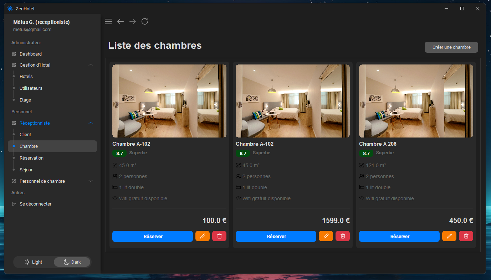
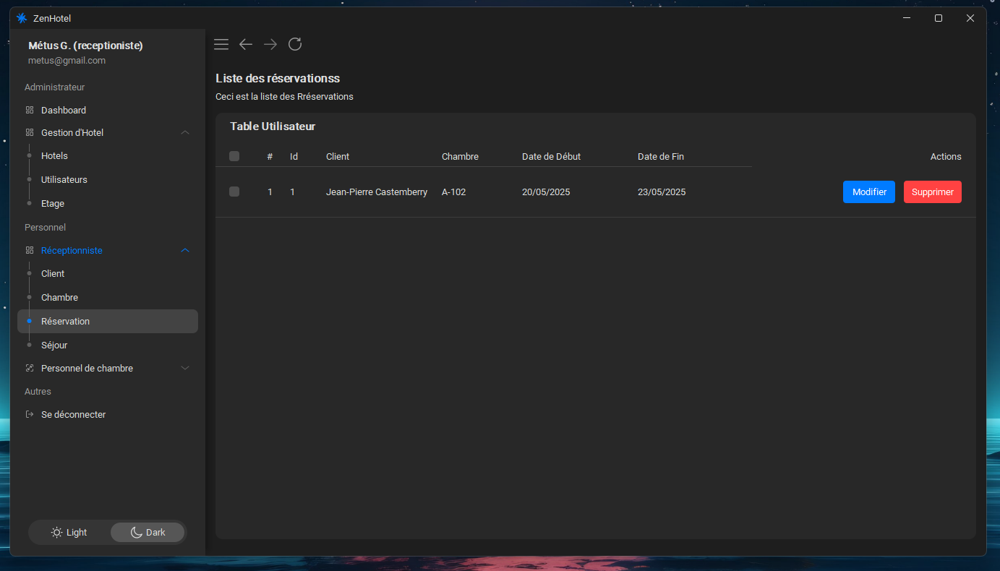
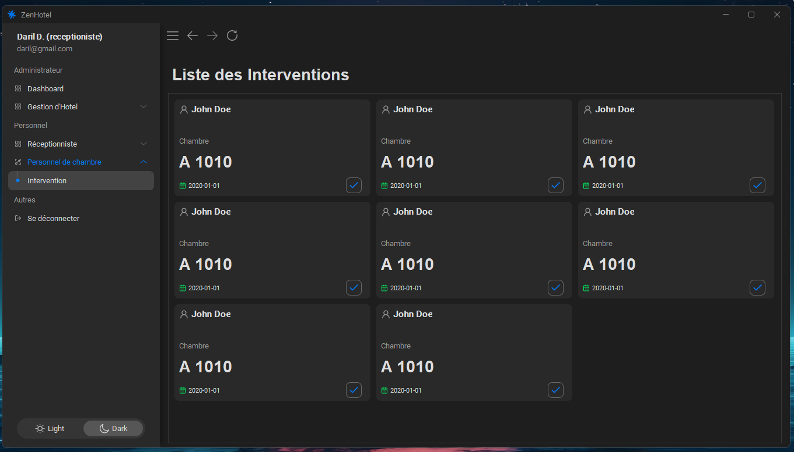

# Application de Gestion Hôtelière


## Présentation

**Application de Gestion Hôtelière** est une application desktop complète développée en Java, destinée à faciliter la gestion quotidienne des opérations d’un hôtel. Elle propose une solution intégrée pour la gestion des réservations, du personnel, des clients, des chambres et des services, le tout via une interface utilisateur moderne et intuitive.

## Fonctionnalités principales

- **Gestion complète des réservations et des séjours**
- **Administration des chambres** avec différentes catégories
- **Suivi des clients** et de leurs consommations
- **Gestion du personnel** et des interventions
- **Système de facturation intégré**
- **Interface utilisateur intuitive** avec design moderne (FlatLaf)
- **Reporting** et génération de factures PDF

## Technologies utilisées

- **Java**
- **SQLite** pour la persistance des données
- **Swing** avec [FlatLaf](https://www.formdev.com/flatlaf/) pour l’interface graphique
- **MigLayout** pour une mise en page flexible
- **Architecture MVC** (Model-View-Controller)
- **DatePicker** personnalisé pour la gestion des dates

## Points forts

- Base de données relationnelle robuste avec gestion des relations entre entités
- Interface utilisateur moderne et responsive
- Système modulaire pour une maintenance et une évolution facilitées
- Gestion complète du cycle de vie des séjours hôteliers
- Fonctionnalités avancées de reporting et facturation

## Réalisations clés

- Développement d’une architecture modulaire et évolutive
- Implémentation d’une interface utilisateur intuitive et moderne
- Création d’un système de gestion de données sécurisé
- Intégration de fonctionnalités complètes de gestion hôtelière

## Installation

1. **Cloner le dépôt :**
   ```sh
   git clone https://github.com/DarilDivin/hotel-management
   ```
2. **Ouvrir le projet dans votre IDE Java préféré (ex : IntelliJ IDEA, Eclipse, VS Code).**
3. **Construire le projet avec Maven :**
   ```sh
   mvn clean install
   ```
4. **Lancer l’application :**
   - Exécuter la classe `Main` dans [src/main/java/Main.java](src/main/java/Main.java).

## Captures d’écran

Voici quelques captures d’écran de l’application :


*Écran d’accueil de l’application*


*Interface de connexion*


*Gestion des chambres et catégories*


*Gestion des réservations*


*Interventions*


## Auteurs

- Projet réalisé dans le cadre de l’**Université Évry Paris-Saclay**
- Réalisé par **Daril DJODJO KOUTON** & **José-Marie LAOUROU**


<!-- --- -->

<!-- © 2025 DarilDivin – Tous droits réservés. -->